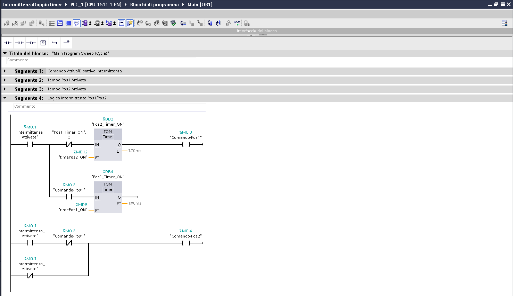

# PLCDualTimerDemo

Esempio completo e gratuito di logica LAD per ottenere un'intermittenza alternata su due comandi
tramite timer IEC `TON`. Il progetto è destinato allo studio e all'adattamento in applicazioni
Siemens compatibili; non è una versione demo limitata.



## Funzionamento

L'abilitazione generale avvia la sequenza. I due temporizzatori comandano alternativamente
`Comando-Pos1` e `Comando-Pos2`; i tempi delle due fasi sono configurabili separatamente. La
schermata fornita mostra il blocco ciclico `Main [OB1]` e i quattro segmenti:

1. comando di attivazione/disattivazione dell'intermittenza;
2. tempo di attivazione della posizione 1;
3. tempo di attivazione della posizione 2;
4. logica di alternanza tra posizione 1 e posizione 2.

La descrizione dei tag leggibili e la sequenza osservata sono raccolte in
[`docs/LOGIC.md`](docs/LOGIC.md). Lo screenshot documenta il codice nell'editor, ma non dimostra
una compilazione riuscita né un'esecuzione online.

## Requisiti rilevati

- Siemens TIA Portal V18 Update 5 o versione esplicitamente compatibile;
- progetto versione `18.0.1.0`;
- stazione `S7-1500/ET 200MP`;
- CPU 1511-1 PN, articolo `6ES7 511-1AL03-0AB0`, firmware V3.0;
- PLCSIM compatibile oppure hardware adeguato per la verifica operativa.

## Contenuto

- `IntermittenzaDoppioTimer.ap18`: descrittore principale del progetto TIA Portal;
- `System/`, `IM/`, `Vci/`, `XRef/` e `AdditionalFiles/`: dati tecnici del progetto;
- `docs/LOGIC.md`: panoramica della logica e dei tag visibili;
- `docs/TEST_CHECKLIST.md`: procedura di compilazione e collaudo;
- `docs/images/tia-portal-ob1-ladder.png`: schermata del codice in TIA Portal;
- `LICENSE`: licenza MIT del materiale originale;
- `THIRD_PARTY_NOTICES.md`: titolarità di strumenti, componenti e marchi Siemens.

## Apertura sicura

Aprire inizialmente una copia del progetto. Una migrazione automatica eseguita da una versione più
recente di TIA Portal può impedire la riapertura con la versione originale. Prima di caricare il
programma su un PLC reale, verificare indirizzi, mapping I/O, tempi, stato iniziale, arresto sicuro
e comportamento al riavvio seguendo [`docs/TEST_CHECKLIST.md`](docs/TEST_CHECKLIST.md).

## Stato della verifica

- struttura e metadati del progetto ispezionati localmente;
- ambiente, CPU e blocco `Main [OB1]` confermati visivamente;
- screenshot LAD acquisito il 15 agosto 2026;
- nessuna prova di compilazione, simulazione PLCSIM o download su hardware registrata in questa
  release candidata.

Il pacchetto deve quindi essere considerato materiale didattico **non validato per uso produttivo**.
L'utilizzatore è responsabile della revisione e del collaudo nel proprio ambiente.

## Download

La prerelease pubblica più recente è
[`v1.0.0-rc1`](https://github.com/DDF-Technology/PLCDualTimerDemo/releases/tag/v1.0.0-rc1).
Scaricare sia l'archivio TIA Portal sia il relativo file `.sha256`, quindi verificare l'integrità
prima dell'apertura:

```powershell
Get-FileHash -Algorithm SHA256 .\PLCDualTimerDemo-1.0.0-rc1-tia-v18.zip
```

Il digest atteso dello ZIP è
`565e73b0b3b975d6421ab2ea8bac1ab2d49b317125236a27cee18ecfaec8e86d`.

## Licenza

Copyright © 2026 Fabio De Deo — [www.ddf.technology](https://www.ddf.technology/).

La logica originale e la documentazione sono distribuite sotto [licenza MIT](LICENSE), senza
limitazioni funzionali e senza garanzia. Siemens, SIMATIC, TIA Portal e PLCSIM restano marchi o
prodotti dei rispettivi titolari; vedere [THIRD_PARTY_NOTICES.md](THIRD_PARTY_NOTICES.md).
